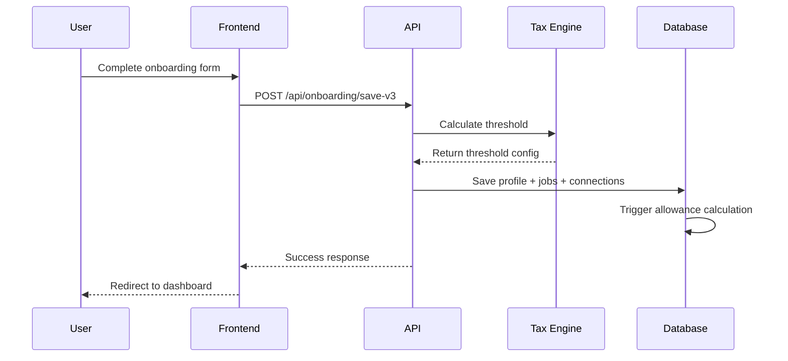
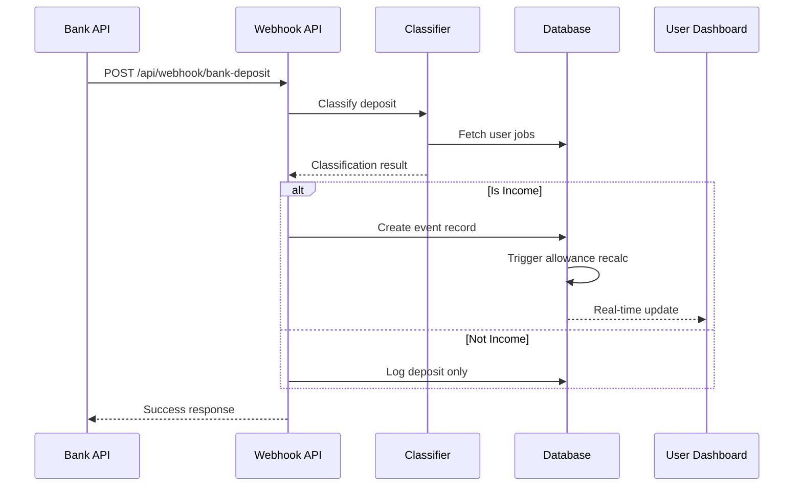
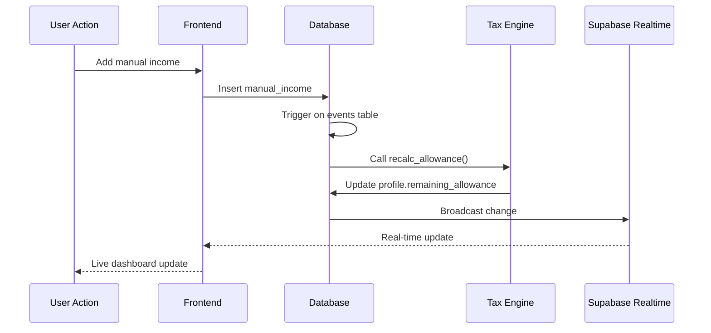

# Architecture Documentation

## System Overview

「扶養わかるんです。」is built as a modern, cloud-native FinTech application with real-time capabilities and intelligent automation. The architecture prioritizes security, performance, and user experience while handling complex Japanese tax calculations.

## High-Level Architecture

```plantuml
@startuml
!define RECTANGLE class
!define ACTOR actor
!define DATABASE database
!define CLOUD cloud
!define COMPONENT component

ACTOR User
RECTANGLE "Next.js Frontend" as Frontend {
  COMPONENT "Onboarding Wizard" as Onboarding
  COMPONENT "Dashboard" as Dashboard  
  COMPONENT "Settings" as Settings
}

RECTANGLE "API Layer" as API {
  COMPONENT "Auth Routes" as AuthAPI
  COMPONENT "Onboarding API" as OnboardingAPI
  COMPONENT "Webhook API" as WebhookAPI
}

DATABASE "Supabase PostgreSQL" as DB {
  COMPONENT "profiles" as Profiles
  COMPONENT "events" as Events
  COMPONENT "manual_incomes" as ManualIncomes
  COMPONENT "jobs" as Jobs
  COMPONENT "deposits" as Deposits
}

RECTANGLE "Business Logic" as Logic {
  COMPONENT "Tax Calculator" as TaxCalc
  COMPONENT "Deposit Classifier" as DepositClass
  COMPONENT "Allowance Engine" as AllowanceEngine
}

CLOUD "External Services" as External {
  COMPONENT "Bank Webhooks" as BankAPI
  COMPONENT "Sentry" as Sentry
  COMPONENT "LogRocket" as LogRocket
}

RECTANGLE "Infrastructure" as Infra {
  COMPONENT "Vercel Hosting" as Vercel
  COMPONENT "GitHub Actions" as CI
  COMPONENT "Supabase Auth" as Auth
}

User --> Frontend
Frontend --> API
API --> Logic
Logic --> DB
API --> External
WebhookAPI <-- BankAPI
Logic --> Sentry
Frontend --> LogRocket
Vercel --> Frontend
CI --> Vercel
Auth --> User

@enduml
```

## Core Components

### 1. Frontend Layer (Next.js 15)

#### Adaptive Onboarding System
- **Conditional Navigation**: 8-screen wizard with age and status-aware flow
- **Real-time Validation**: Instant feedback on user inputs
- **Progress Tracking**: Visual indicators and step completion
- **Responsive Design**: Mobile-first approach with Tailwind CSS

#### Dashboard Interface  
- **Real-time Updates**: Live allowance calculations via Supabase subscriptions
- **Visual Analytics**: Charts and progress indicators for income tracking
- **Manual Input**: CRUD interface for non-automated income sources
- **Webhook Simulator**: Testing interface for bank deposit classification

#### State Management
```typescript
// Zustand store for global state
interface AppState {
  user: User | null
  profile: Profile | null
  currentIncome: number
  remainingAllowance: number
  dangerLevel: 'safe' | 'warn' | 'danger'
}
```

### 2. API Layer (Next.js API Routes)

#### Authentication & Authorization
- **Supabase Auth Integration**: JWT-based authentication with RLS
- **Session Management**: Secure cookie handling with httpOnly flags
- **Route Protection**: Middleware for authenticated routes

#### Onboarding API (`/api/onboarding/save-v3`)
- **Atomic Operations**: Transaction-like batch operations for data consistency
- **Profile Creation**: User profile setup with adaptive threshold calculation
- **Job Registration**: Employer information for deposit classification
- **Bank Setup**: Connection metadata for webhook routing

#### Webhook API (`/api/webhook/bank-deposit`)
- **Deposit Processing**: Intelligent classification using fuzzy matching
- **Event Creation**: Automatic income event generation for classified deposits
- **Real-time Updates**: Triggers allowance recalculation via database functions

### 3. Data Layer (Supabase PostgreSQL)

#### Database Schema Design

```sql
-- Core profile with adaptive fields
profiles {
  user_id: UUID (PK)
  date_of_birth: DATE
  is_student: BOOLEAN
  insurance_status: ENUM('parent', 'self')
  future_self_ins_date: DATE
  remaining_allowance: INTEGER
  current_income: INTEGER
}

-- All income events for audit trail
events {
  id: UUID (PK)
  user_id: UUID (FK)
  amount: INTEGER
  event_date: DATE
  source: TEXT
  source_id: UUID
}

-- User-entered income tracking
manual_incomes {
  id: UUID (PK)
  user_id: UUID (FK)
  amount: INTEGER
  taxable: BOOLEAN
  category: ENUM
}

-- Employer data for classification
jobs {
  id: UUID (PK)
  user_id: UUID (FK)
  employer_name: TEXT
  job_type: ENUM
}
```

#### Real-time Triggers
```sql
-- Automatic allowance recalculation on income changes
CREATE TRIGGER income_change_trigger
  AFTER INSERT OR UPDATE OR DELETE ON events
  FOR EACH ROW
  EXECUTE FUNCTION recalc_allowance();
```

#### Row Level Security (RLS)
- **User Isolation**: Complete data separation between users
- **Policy Enforcement**: Postgres-level access control
- **Automated Testing**: CI pipeline validates RLS policies

### 4. Business Logic Layer

#### Tax Calculation Engine (`lib/tax-walls.ts`)

```typescript
// Core threshold decision logic
export function decideThreshold(params: {
  dob: Date
  student: boolean
  insurance_status: 'parent' | 'self'
  future_self_ins_date?: Date
  eventDate?: Date
}): ThresholdResult {
  const age = calculateAge(params.dob, params.eventDate)
  
  // Self-insurance always uses social insurance limit
  if (params.insurance_status === 'self') {
    return {
      currentWall: WALLS.socialInsurance,
      currentWallType: 'socialInsurance',
      isIndependentMode: true
    }
  }
  
  // Future insurance date logic
  if (params.future_self_ins_date && 
      isDateInPast(params.future_self_ins_date, params.eventDate)) {
    return {
      currentWall: WALLS.socialInsurance,
      currentWallType: 'socialInsurance', 
      isIndependentMode: true
    }
  }
  
  // Student special provision (19-22 years old)
  if (params.student && age >= 19 && age <= 22) {
    return {
      currentWall: WALLS.incomeStudent,
      currentWallType: 'incomeStudent',
      isIndependentMode: false
    }
  }
  
  // Default to general income limit
  return {
    currentWall: WALLS.incomeGeneral,
    currentWallType: 'incomeGeneral',
    isIndependentMode: false
  }
}
```

#### Deposit Classification (`lib/deposit-classifier.ts`)

```typescript
// Fuzzy matching for bank deposits
export function classifyDeposit(
  description: string,
  userJobs: Job[]
): ClassificationResult {
  let bestMatch: Job | null = null
  let highestConfidence = 0
  
  for (const job of userJobs) {
    const confidence = calculateSimilarity(
      description.toLowerCase(),
      job.employer_name.toLowerCase()
    )
    
    if (confidence > highestConfidence && confidence > CONFIDENCE_THRESHOLD) {
      bestMatch = job
      highestConfidence = confidence
    }
  }
  
  return {
    isIncome: highestConfidence > CONFIDENCE_THRESHOLD,
    jobId: bestMatch?.id,
    confidence: highestConfidence,
    matchedKeywords: extractKeywords(description)
  }
}
```

### 5. External Integrations

#### Bank Webhook Processing
- **Webhook Validation**: Signature verification and payload validation
- **Fuzzy Matching**: Levenshtein distance algorithm for employer recognition
- **Confidence Scoring**: Machine learning-inspired confidence thresholds
- **Fallback Handling**: Manual classification for low-confidence matches

#### Monitoring & Analytics
- **Sentry Integration**: Error tracking with custom contexts for financial operations
- **LogRocket Session Replay**: Optional debugging with privacy controls
- **Performance Monitoring**: Real-time performance metrics and alerting

## Data Flow

### 1. User Onboarding Flow



### 2. Bank Webhook Processing



### 3. Real-time Allowance Updates



## Security Architecture

### Authentication & Authorization

```typescript
// Middleware for route protection
export async function middleware(request: NextRequest) {
  const { data: { user } } = await supabase.auth.getUser()
  
  if (!user && isProtectedRoute(request.nextUrl.pathname)) {
    return NextResponse.redirect('/login')
  }
  
  // Set user context for RLS
  if (user) {
    await supabase.rpc('set_current_user_id', { user_id: user.id })
  }
  
  return NextResponse.next()
}
```

### Row Level Security Implementation

```sql
-- Profiles table RLS
CREATE POLICY "Users can only access their own profile"
  ON profiles FOR ALL
  USING (auth.uid() = user_id);

-- Events table RLS  
CREATE POLICY "Users can only access their own events"
  ON events FOR ALL
  USING (auth.uid() = user_id);

-- Manual incomes RLS
CREATE POLICY "Users can only access their own manual incomes"
  ON manual_incomes FOR ALL
  USING (auth.uid() = user_id);
```

### API Security Measures

- **Input Validation**: Zod schemas for all API inputs
- **Rate Limiting**: Per-user and per-IP rate limits
- **CORS Configuration**: Restricted origins and methods
- **Error Handling**: Sanitized error responses to prevent information leakage

## Performance Optimizations

### Database Performance

- **Indexing Strategy**: Optimized indexes for user_id and date queries
- **Connection Pooling**: Supabase built-in connection management
- **Query Optimization**: Efficient JOIN operations and selective column retrieval

### Frontend Performance

- **Code Splitting**: Dynamic imports for non-critical components
- **Image Optimization**: Next.js Image component with lazy loading
- **Caching Strategy**: SWR for API response caching
- **Bundle Optimization**: Tree shaking and minification

### Real-time Performance

- **Selective Subscriptions**: Only subscribe to relevant data changes
- **Debounced Updates**: Prevent excessive re-renders from rapid changes
- **Optimistic Updates**: Immediate UI feedback with rollback on errors

## Scalability Considerations

### Horizontal Scaling

- **Stateless Design**: All state stored in database or client
- **CDN Integration**: Static assets served via Vercel Edge Network
- **Database Read Replicas**: Supabase automatic read scaling

### Vertical Scaling

- **Resource Optimization**: Efficient memory usage and CPU utilization
- **Database Tuning**: Query optimization and index management
- **Caching Layers**: Redis for session storage and frequently accessed data

## Monitoring & Observability

### Application Monitoring

```typescript
// Custom Sentry integration
export const trackFinancialOperation = (
  operation: string,
  data: FinancialData
) => {
  Sentry.addBreadcrumb({
    category: 'financial',
    message: operation,
    data: {
      amount: data.amount,
      threshold: data.threshold,
      dangerLevel: data.dangerLevel
    }
  })
}
```

### Performance Monitoring

- **Core Web Vitals**: LCP, FID, CLS tracking via web-vitals
- **API Response Times**: Custom metrics for critical endpoints
- **Database Performance**: Query timing and connection pool metrics

### Error Tracking

- **Structured Logging**: JSON logs with correlation IDs
- **Error Contexts**: Rich error information for debugging
- **Alert Configuration**: Slack/email notifications for critical errors

## Development Workflow

### Local Development

```bash
# Setup development environment
npm run setup              # Automated environment setup
npm run dev               # Start development server
npm run test:watch        # Run tests in watch mode
npm run storybook         # Component development
```

### Testing Strategy

- **Unit Tests**: Jest for business logic and utilities
- **Integration Tests**: API route testing with mock database
- **E2E Tests**: Playwright for complete user workflows  
- **Security Tests**: Automated RLS policy validation
- **Performance Tests**: Load testing for webhook endpoints

### CI/CD Pipeline

```yaml
# GitHub Actions workflow
jobs:
  - install: Dependency installation (Node 18/20)
  - lint: Code quality checks
  - unit: Unit test execution
  - rls-audit: Security policy validation
  - e2e: End-to-end testing
  - build: Production build validation
  - deploy: Automated deployment to staging/production
```

## Future Architecture Considerations

### Microservices Migration

- **Service Boundaries**: User management, tax calculation, webhook processing
- **Inter-service Communication**: Event-driven architecture with message queues
- **Data Consistency**: Distributed transaction patterns

### Advanced Features

- **Machine Learning**: Improved deposit classification with ML models
- **Real-time Notifications**: WebSocket connections for instant alerts
- **Multi-tenancy**: Support for tax advisors managing multiple clients
- **Audit Trail**: Comprehensive logging for regulatory compliance

### Compliance & Regulatory

- **Data Residency**: Japan-specific data storage requirements
- **Audit Logging**: Immutable audit trail for financial operations
- **Privacy Controls**: GDPR-style data export and deletion
- **Regulatory Reporting**: Automated tax authority reporting capabilities